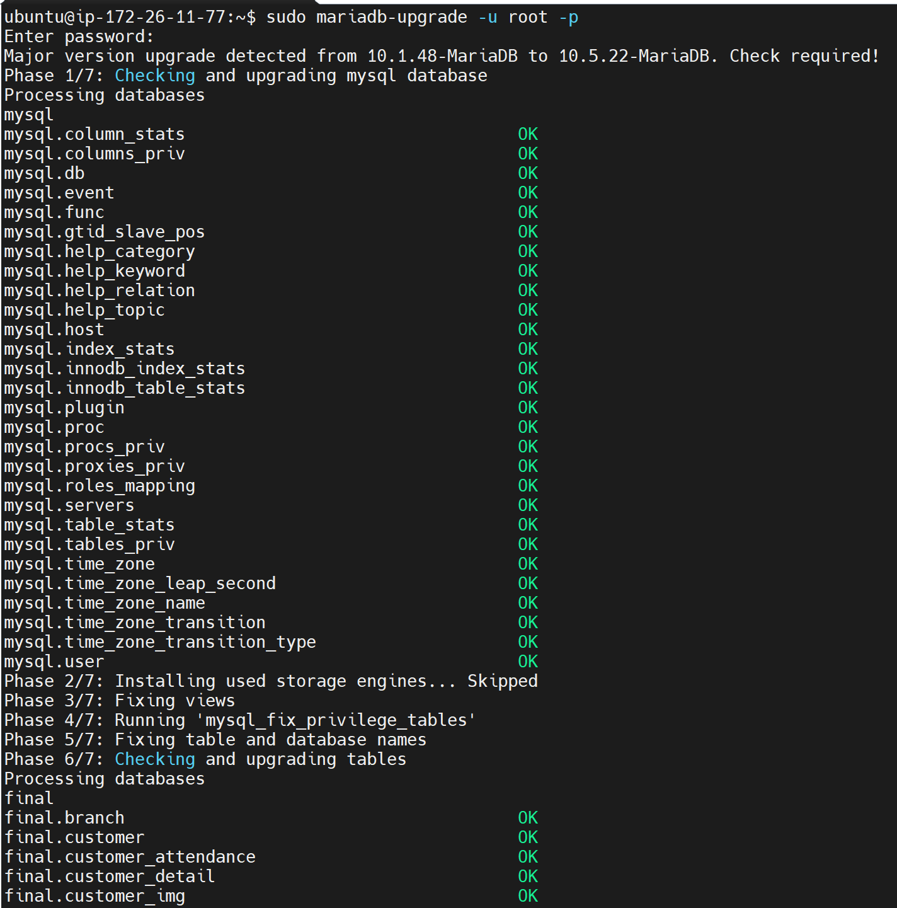

## 개발노트[정인호]

``
-
`231223`  
- 빌드툴 메이븐이 src/main/java 경로 아래의 xml을 무시하는 경우가 있어서 pom.xml에 <build> 하위에 Resources 추가하였음 (일반적으로 클래스패스인 resources/mapper/를 프로퍼티설정에 mapper xml 위치로 지정하는 것이 권장되나 팀원들이 매퍼인터페이스와 xml파일을 동일경로에 위치하는 것에 익숙하여 설정을 추가했음) 또한 관련 테스트 작성시 src/test/java 패키지에서도 xml copy 무시 문제가 발생되었고 설정을 추가하여 해결하였음
- 어제 생성한 Vo SportsEquipment를 test 패키지에서 생성한 매퍼를 가지고 테스트코드를 작성하여 DB insert, select가 정상작동하는지 단위테스트를 시행했으며 테스트 중에서 필드명 오타를 발견하여 수정하였으며 테스트 완료했음
- primitive 타입의 초기화시 생기는 기본값 때문에 (int는 0가 되기 때문)에 도메인로직에서 null 체크를 위해 SportsEquipment 정수 필드를 Integer로 했지만 만든 Vo가 공용으로 사용되고, Wrapper 클래스 간의 비교연산시 ==과 .equal를 구분해서 사용해야하기 때문에 팀원들이 불편해 할 수 있기 때문에 어제 생성한 vo클래스의 멤버변수를 int타입으로 변경함
- DB서버의 mariaDB 버전이 10.5인데 최초 DDL로 데이터베이스 초기화시 10.4버전의 DDL Script로 초기화했었다. 그래서 사용중인 IDE에서 데이터 베이스 스키마와 RDBMS의 버전불일치 경고가 발생했다. 서버로 직접 접속하여 DB버전을 업그레이드했다.

`231222`
- 어제 없던 팀원들에게 진행상황과 프로퍼티 설정을 설명함
- 게시판 컨트롤러를 작성하던 팀원이 시드데이터와 로그인한 계정 오브젝트가 없어 접근제어 구현에 어려움을 겪었음. 임시 세션 로그인 기능을 구현하도록 도와줌
- 지점관리페이지의 외부 템플릿을 풋터,해더, 사이드바 등으로 구분하여 페이지 청사진을 만듦
- Branch, 및 SportEquipment에 대한 vo를 작성

`231221`
- light sail DB 서버를 구축하고 원격접속을 허용함
  - mariadb 10.5 install
  - 데이터베이스 DDL 초기화
- 프로젝트 파일을 init
  - 프로퍼티 초기설정
    - db서버 접속용 프로퍼티를 분리 후 add git ignore.
    - log level, file upload 설정추가
    - 팀원의 정적리소스 로딩 문제가 있었고 트러블슈팅함: 서버 컨택스트 패스를 "/"로 변경하고 리로스 참조 경로를 부트 자동구성경로를 사용하도록 함
  - DB server 접속확인용 테스트코드 작성 
  - 패키지 기본구조를 커밋
  - 의존성 추가 작업
  - 깃허브로 협업하는 방법을 이슈-feature #No 브랜치, pull request 방식으로 협의
